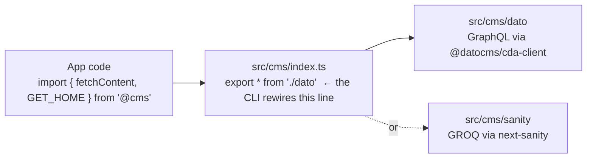

# CMS Adapters

Tackl talks to a CMS through one seam: `@cms` (`src/cms/`). Application code never imports an adapter directly, so the choice of CMS never touches component code.



## The surface

Both adapters export the same things:

| Export | What it is |
| --- | --- |
| `fetchContent<T>(query, options?)` | Runs the query, returns `T` or **`null` on any failure** (missing token, network, bad query) — it never throws, so an unconfigured CMS can't crash a route |
| `GET_HOME`, `GET_GLOBAL`, … | Query strings (GraphQL for Dato, GROQ for Sanity) living in `src/cms/{adapter}/queries/` |
| `performRequest` (Dato) / `client` (Sanity) | Adapter-native extras |

Usage in a Server Component (page, layout — anywhere async):

```tsx
import { fetchContent, GET_HOME } from '@cms';

const Page = async () => {
	const data = await fetchContent<HomeData>(GET_HOME);
	return <h1>{data?.page?.pageTitle ?? 'Fallback'}</h1>;
};
```

## Choosing an adapter

- **Via the CLI (recommended):** `bunx tackl` asks Dato / Sanity / None and prunes the repo accordingly — the unused adapter folder, its dependencies, its docs, and its `.env.example` block are removed, and `src/cms/index.ts` re-exports the one you chose.
  - **Choosing Sanity** keeps the full setup, not just the fetch adapter: the embedded Studio at `/studio` (`app/(studio)/studio/[[...tool]]/page.tsx`, configured by `sanity.config.ts` at the repo root), schemas in `sanity/schemaTypes/` (`homePage`, `siteSettings` — matching the GROQ queries in `src/cms/sanity/queries`), and the draft-mode preview routes under `app/api/draft-mode/`. The CLI also offers to run `bunx sanity init --env .env` (browser login, creates/links a project, writes `.env`).
  - **Choosing DatoCMS or None** prunes all of that: `app/(studio)`, `app/api/draft-mode`, `sanity.config.ts`, `sanity/`, and the `sanity` / `@sanity/vision` / `next-sanity` dependencies.
- **Manually:** edit the one line in `src/cms/index.ts` (`export * from './dato'` ⇄ `'./sanity'`), delete the unused adapter folder, and remove its dependencies (`@datocms/cda-client`, `react-datocms`, `graphql`, `graphql-tag` for Dato; `sanity`, `@sanity/vision`, `next-sanity` for Sanity). When switching **away from Sanity** by hand, also delete the studio scaffolding: `app/(studio)/`, `app/api/draft-mode/`, `sanity.config.ts`, and `sanity/`.

## Environment

| Adapter | Variables |
| --- | --- |
| DatoCMS | `NEXT_DATOCMS_API_TOKEN` |
| Sanity | `NEXT_PUBLIC_SANITY_PROJECT_ID`, `NEXT_PUBLIC_SANITY_DATASET`, `NEXT_PUBLIC_SANITY_API_VERSION` |

`fetchContent` checks its config at call time and logs a clear error (returning `null`) when a value is missing or still `CHANGE_ME`. The Sanity client also falls back to a `placeholder` project id, so an unconfigured build still compiles — the guard only fires when content is actually fetched.

## Going deeper

- DatoCMS patterns (images, structured text, SEO, realtime): [docs/DatoCMS](./DatoCMS)
- Full Sanity setup (schemas, studio, visual editing): [docs/Sanity/README.md](./Sanity/README.md)
