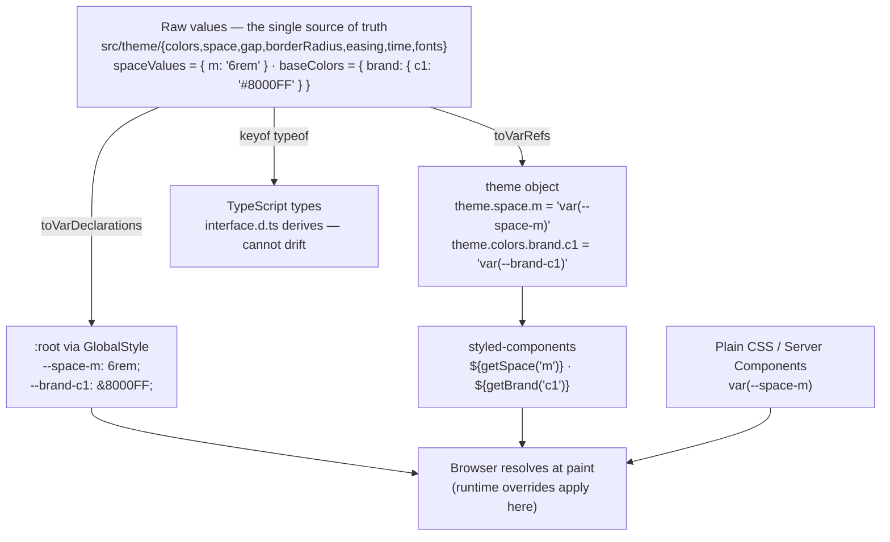

# Theming & Design Tokens

Tackl's tokens are defined once in TypeScript and emitted once as CSS custom properties. Everything else — styled-components, plain CSS, Server Components — reads the same variables.

## How it works



```
theme.space.m         === 'var(--space-m)'
theme.colors.brand.c1 === 'var(--brand-c1)'
```

Because every theme value is a `var()` reference, the browser resolves tokens at paint time. Styles that import `theme` statically (the semantic `Div` component, type styles, waffl grid) and styles that read `props.theme` produce identical CSS — there is one source of truth, and overriding a variable at runtime restyles both.

## Variable naming

| Section | Pattern | Example |
| --- | --- | --- |
| Colors | `--{group}-{name}` | `--brand-c1`, `--global-white`, `--feedback-positive` |
| Space | `--space-{key}` | `--space-s` … `--space-xl`, `--space-col` |
| Gap | `--gap-{key}` | `--gap-xxs` … `--gap-uber` |
| Border radius | `--br-{key}` | `--br-xs` … `--br-round` |
| Easing | `--easing-{key}` | `--easing-bezzy`, `--easing-bezzy2` |
| Time | `--time-{key}` | `--time-s`, `--time-m`, `--time-l` |
| Font stacks | `--font-{key}` | `--font-heading`, `--font-body` |

## Using tokens

### In styled-components (unchanged)

The existing APIs work exactly as before — they now emit `var()` references under the hood:

```tsx
import styled, { css } from 'styled-components';
import { Div, getBrand, getGlobal, getSpace } from '@tackl';

export const Jacket = styled(Div)(
	props => css`
		padding: ${getSpace('m')};
		background: ${getBrand('c1')};
		color: ${getGlobal('white', 80)};
		border-radius: ${props.theme.br.m};
	`
);
```

### In plain CSS and Server Components

Tokens are now usable anywhere CSS is, with no styled-components (and no `'use client'`) required:

```css
.card {
	padding: var(--space-m);
	background: var(--brand-c3);
	border-radius: var(--br-m);
	transition: transform var(--time-m) var(--easing-bezzy);
}
```

```tsx
// A Server Component — no client boundary needed for token styling
const Badge = () => <span style={{ color: 'var(--feedback-positive)' }}>Live</span>;
```

### Opacity

Color tokens are plain `var()` references — there is no per-shade object. Opacity is applied at the point of use, either through a getter or the `alpha()` helper:

```
getBrand('c1')          →  var(--brand-c1)
getBrand('c1', 50)      →  color-mix(in srgb, var(--brand-c1) 50%, transparent)

alpha('--brand-c1', 50) →  color-mix(in srgb, var(--brand-c1) 50%, transparent)
alpha('#8000FF', 50)     →  color-mix(in srgb, #8000FF 50%, transparent)
```

`alpha(color, opacity)` (from `@tackl`) takes a CSS variable name, a theme token, or any color value:

```tsx
import { alpha } from '@tackl';

export const Card = styled(Div)(
	props => css`
		background: ${alpha('--brand-c3', 40)};
		border-color: ${alpha(props.theme.colors.global.white, 15)};
	`
);
```

The browser does the mixing, so translucent uses follow runtime theme overrides too. In hand-written CSS, use `color-mix()` directly for the same effect.

## Runtime theming

Redefine variables under a selector and every consumer follows — no JS, no re-render:

```css
html[data-theme='dark'] {
	--global-white: #000000;
	--global-black: #ffffff;
	--brand-c1: #9b30ff;
}
```

Toggle by stamping the attribute (e.g. `document.documentElement.dataset.theme = 'dark'`, or server-side on the `<html>` tag to avoid a flash). The same mechanism handles multi-brand/white-label builds: one attribute per brand, one block of overrides each.

`ThemeProvider` still wraps the app — it provides the typed `props.theme` DX — but it is no longer the theming mechanism. Swapping the object it receives is neither necessary nor sufficient for retheming; the CSS variables are.

## Adding or changing a token

1. Edit the **raw values** object in the token's file — e.g. `spaceValues` in `src/theme/space/index.ts`, or `baseColors` in `src/theme/colors/index.ts`.
2. Done. The `:root` declaration, the `var()` reference, and the TypeScript type are all derived from that same object (`toVarRefs` / `toVarDeclarations` in `src/theme/cssVariables`; each `interface.d.ts` derives from the values via `keyof typeof`), so none of them can drift and there is nothing else to update.

## What is NOT a CSS variable (and why)

- **Breakpoints & grid** (`theme.grid`) — media queries cannot read CSS variables, so these are build-time tokens. Changing them means a rebuild, not a runtime override.
- **Font weights** (`theme.font.weight`) — literal numbers; weights aren't runtime-themeable and are occasionally needed as numbers in JS (e.g. animation targets).
- **`getVw()` design widths** (`theme.grid.design`) — numbers used for build-time math.

## Storybook

`.storybook/preview.js` renders `<GlobalStyle />` inside the theme decorator, so the `:root` variables exist in the preview iframe and stories resolve tokens exactly like the app.
