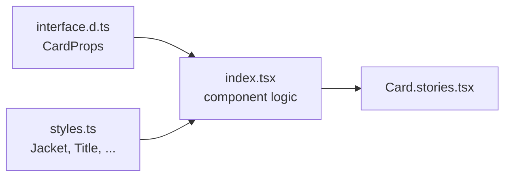
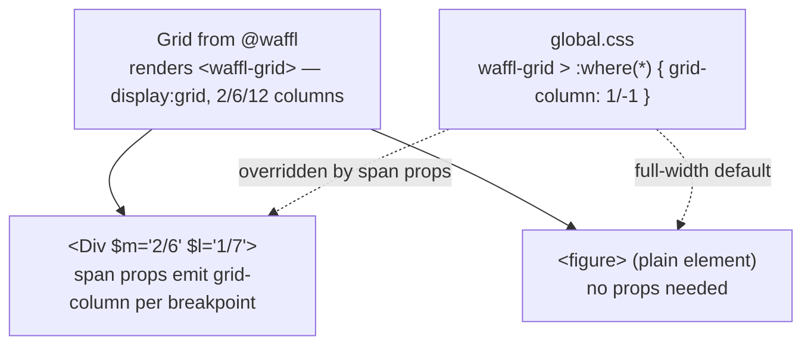

# Writing Components — The Tackl House Style

How components are structured, commented, and wired into the theme and grid. Follow this and every component in the project reads the same way.

## Component anatomy

Every component lives in its own folder under `src/components/`:

```
src/components/Card/
├── index.tsx          # The component — logic and markup only
├── styles.ts          # ALL styled-components for this component
├── interface.d.ts     # The component's prop types
└── Card.stories.tsx   # Storybook story (optional)
```



Rules:

- **No styled-components in `index.tsx`.** Styling lives in `styles.ts`, imported as a namespace: `import * as S from './styles'`.
- **The outermost styled component is always called `Jacket`.** Inner ones get descriptive names (`Title`, `Hint`, `Content`, `Coat`).
- **Props are typed in `interface.d.ts`**, imported as `import type * as I from './interface'`.

## The comment style

Files are organised with comment banners — every file, same order:

```tsx
// Imports
// ------------

// Styles + Interfaces
// ------------

// Component
// ------------

// Exports
// ------------
```

Inline annotations use bullet markers:

- `// SECTION •` — a region of related code
- `// NOTE •` — a constraint or behaviour the code can't show on its own
- `// ANCHOR •` — an important function or entry point
- `// REVIEW —` — usage example worth reading

## A complete component

**`src/components/Card/interface.d.ts`**

```tsx
// Imports
// ------------

// Exports
// ------------
export interface CardProps {
	title: string;
	href?: string;
}
```

**`src/components/Card/styles.ts`**

```tsx
// Imports
// ------------
import styled, { css } from 'styled-components';
import { alpha, bp, Div, getBrand, getEase, getRadius, getTime } from '@tackl';
import { bodyS, titleS } from '@tackl/type';

// Exports
// ------------
export const Jacket = styled(Div).attrs({ as: 'article' })(
	() => css`
		display: flex;
		flex-direction: column;
		gap: var(--gap-m);
		padding: var(--gap-l);

		background: ${alpha('--brand-c3', 40)};
		border-radius: ${getRadius('m')};
		transition: background ${getTime('m')} ${getEase('bezzy')};

		&:hover {
			background: ${getBrand('c3')};
		}

		${bp.l`
			padding: var(--gap-xl);
		`}
	`
);

export const Title = styled(Div).attrs({ as: 'h3' })(
	() => css`
		${titleS}
	`
);

export const Body = styled(Div).attrs({ as: 'p' })(
	() => css`
		${bodyS}
	`
);
```

**`src/components/Card/index.tsx`**

```tsx
// Imports
// ------------

// Styles + Interfaces
// ------------
import type * as I from './interface';
import * as S from './styles';

// Component
// ------------
const Card = ({ title, href }: I.CardProps) => {
	return (
		<S.Jacket>
			<S.Title>{title}</S.Title>
			<S.Body>…</S.Body>
		</S.Jacket>
	);
};

// Exports
// ------------
Card.displayName = 'Card';
export default Card;
```

## Import cheat sheet

| Import | Gives you | Use for |
| --- | --- | --- |
| `@tackl` | `Div`, `bp`, `bpd`, `alpha`, `noscrollbars`, getters (`getBrand`, `getGlobal`, `getFeedback`, `getSpace`, `getGap`, `getRadius`, `getEase`, `getTime`, `getFont`, `getFontWeight`) | Everything you style with |
| `@tackl/type` | `displayL`/`displayS`, `headlineL`/`headlineS`, `titleL`/`titleS`, `bodyL`/`bodyS`, `captionL`/`captionS` | Global text styles, composed into styled blocks |
| `@waffl` | `Grid` (default export) | The grid container |
| `@theme` | `theme`, `GlobalStyle` | Rarely needed directly — the getters wrap it |
| `@parts/*` | `src/components/*` | Other components |
| `@utils/*` | `src/utils/*` | Hooks and helpers |
| `@cms` | `fetchContent`, query strings | Data fetching (adapter-agnostic — see docs/CMS.md) |
| `@css/*`, `@public/*` | Global CSS, static assets | |

Per-tag components (`Section`, `H1`, `P`…) **do not exist** — there is one `Div`, and the tag is chosen with `as`.

## `Div` — the one primitive

`Div` is a fully-typed `styled.div` carrying three prop families:

| Family | Props | What they do |
| --- | --- | --- |
| Tag | `as='section'` etc. | Renders any HTML tag with the same powers |
| Spacing | `$mar`, `$marTop`, `$marBottom`, `$pad`, `$padTop`, `$padBottom` | Responsive section spacing from the space tokens (small on mobile → large on desktop, automatically) |
| Grid spans | `$s`, `$sm`, `$m`, `$l`, `$xl`, `$xxl`, `$huge`, `$uber` | `grid-column` per breakpoint, when inside a `Grid` |

Plus every normal HTML attribute (`id`, `style`, `aria-*`, events) with full typing.

In JSX, choose the tag inline; in `styles.ts`, fix it with `.attrs`:

```tsx
<Div as='nav' $padTop>…</Div>                       // inline
export const Jacket = styled(Div).attrs({ as: 'nav' })(…)  // fixed in styles
```

## How `Div` hooks into the Waffl grid

The grid does the defaulting; `Div` does the opting-in.



Three things make this work:

1. **`Grid` renders a plain `<waffl-grid>` tag** — a named element with no JavaScript behind it. All styling comes from the styled component: `display: grid`, responsive column counts (2 on mobile, 6 on tablet, 12 on desktop), and gutters as `--grid-*` variables.
2. **A zero-specificity global rule makes every direct child full-width by default:** `waffl-grid > :where(*) { grid-column: 1 / -1; }`. Because `:where()` has zero specificity, *any* class or span prop on a child wins. This is why plain elements — including Server Components with no styled-components at all — are first-class grid children.
3. **Span props narrow from there.** `$m='2/6'` emits `grid-column: 2/6` inside the `m` media query. Values are raw `grid-column` syntax: `'2/6'` (line 2 to line 6), `'span 4'`, `'1/-1'`.

```tsx
import Grid from '@waffl';
import { Div } from '@tackl';

<Grid $isFixed>
	{/* 2 cols on mobile (full), half the 6-col tablet grid, cols 1-7 of 12 on desktop */}
	<Div as='article' $m='1/4' $l='1/7'>…</Div>

	{/* full width at every breakpoint — no props, no styled-components */}
	<figure>…</figure>
</Grid>
```

Grid container props: `$isFixed` (max-width 1440px), `$noGutter`, `$noMargin`, `$isFullscreen`, `$isCenter` — plus the same spacing props as `Div`.

## `bp` — mobile-first breakpoints

`bp` (from `@tackl`) is a map of **`min-width` media query helpers**. The mental model: **your base styles ARE the mobile styles**; each `bp.{key}` layers changes on top as the viewport grows. You never write mobile overrides — you start there.

| Key | Fires at | Grid columns |
| --- | --- | --- |
| `s` | ≥ 320px | 2 |
| `sm` | ≥ 390px | 2 |
| `m` | ≥ 700px | 6 |
| `l` | ≥ 1024px | 12 |
| `xl` | ≥ 1200px | 12 |
| `xxl` | ≥ 1400px | 12 |
| `huge` | ≥ 1600px | 12 |
| `uber` | ≥ 1800px | 12 |

```tsx
import { bp } from '@tackl';

export const Jacket = styled(Div)(
	() => css`
		/* Mobile — no wrapper needed */
		flex-direction: column;
		gap: var(--gap-m);

		${bp.m`
			/* ≥ 700px */
			flex-direction: row;
		`}

		${bp.l`
			/* ≥ 1024px */
			gap: var(--gap-xl);
		`}
	`
);
```

…compiles to:

```css
.Jacket { flex-direction: column; gap: var(--gap-m); }
@media (min-width: 700px)  { .Jacket { flex-direction: row; } }
@media (min-width: 1024px) { .Jacket { gap: var(--gap-xl); } }
```

`bpd` is the descending (`max-width`) counterpart for the rare "only below this size" case — reach for it sparingly; if you're using `bpd` often, the base styles are probably written desktop-first.

The same scale drives the `Div`/`Grid` span props (`$m`, `$l`, …) and derives from `theme.grid.breakpoints` — add a breakpoint there and `bp`, `bpd`, and the span-prop types all update automatically.

## Do / Don't

| ✅ Do | ❌ Don't |
| --- | --- |
| `<Div as='section' $pad>` | Import `Section` / `H1` / `P` — they don't exist |
| Style in `styles.ts`, name the wrapper `Jacket` | Inline styled-components in `index.tsx` |
| Base styles = mobile, `bp.m`+ upwards | Desktop styles first, `bpd` everywhere |
| `${getBrand('c1')}` / `var(--brand-c1)` | Hard-coded hex values |
| `${alpha('--brand-c1', 20)}` for translucency | Hand-rolled rgba strings |
| Let grid children default to full width | `$s='1/-1'` on everything |
| `transition: x ${getTime('m')} ${getEase('bezzy')}` | Magic duration numbers |
